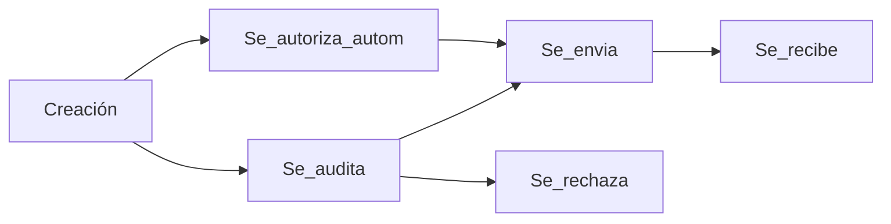
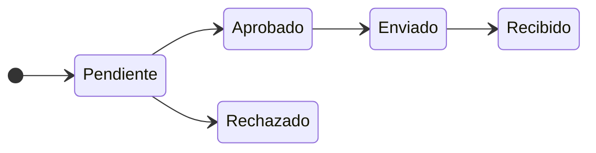

# Alcance del módulo

El sistema permite la gestión de los pedidos de medicamentos que realiza una obra social a las farmacias, cubriendo el trayecto desde que se recibe la orden médica con 
lo que necesita el afiliado, hasta que se le realiza la entrega. El proceso implica la generación, auditoría, envío y confirmación de los pedidos.
El sistema también será capaz de llevar un stock de lo que está disponible.

## Usuarios del sistema

El sistema contará con los siguientes usuarios:
- Operador de carga
- Médico auditor
- Contador
- Farmacéutico

#### Diagrama de casos de uso

### Operador de carga
Encargado de cargar en el sistema lo que recibe está en la orden médica recibida del afiliado. Deberá indicar toda la información pertinente para la auditoría del pedido.
En el caso de los medicamentos que tengan recupero, deberá recibir un aviso por parte del sistema como recordatorio de la información extra que debe pedir al afiliado.
También tendrá la posibilidad de actualizar el listado de medicamentos.
Además, debe poder mantener actualizado el padrón de afiliados a la obra social.

### Médico auditor
Encargado de auditar los pedidos de medicamentos. Si aprueba el pedido, indica el porcentaje del valor que cubrirá la obra social. Puede rechazar un pedido, debieno dar un motivo para el rechazo.

### Contador
Encargado de hacer el pedido de los medicamentos, gestiona los pedidos que hayan sido aprobados para armar las listas que serán enviadas a las farmacias.
Puede exportar las listas en formato de planilla de cálculo y PDF.
Es el encargado de especificar la información de dónde se realizaron los pedidos de los medicamentos, actualizando esta información en el pedido, para que el farmacéutico
sepa de dónde viene, y cuando.

### Farmacéutico
Encargado de recepcionar los medicamentos. Debe indicar cuando se recepcionan los mismos, dando por finalizado el ciclo de vida del pedido. 
Además, es el encargado de mantener actualizado el stock, indicando además cuando se entregan los medicamentos a los afiliados.

## Entidades

### Afiliado
Afiliado que realiza el pedido de medicamentos. La entidad cuenta con los siguientes campos:

- ID
- Nombre
- Apellido
- Sexo
- DNI
- Fecha Nacimiento
- Observaciones

### Sexo
La entidad cuenta con los siguientes campos:

- ID
- Denominación

### Pedido farmacia
Entidad compuesta, contiene el listado de todos los productos y las personas que los pidieron. Tendrá asociado un detalle. 
Se guardan los datos de nombre y dni del afiliado con el fin de evitar un join al momento de recuperar los datos de los pedidos. Considerando también que esos valores pueden ser modificados desde el módulo de afiliación, sirve para registrar a quién se le emitió el pedido en ese momento.
Cuenta con los siguientes atributos:

- ID
- id_afiliado
- Nombre_afiliado
- Dni_afiliado
- Fecha_validez
- Fecha_recepcion
- Patología
- Médico
- Estado

#### Diagrama de flujo de un pedido

#### Diagrama de estados de un pedido

### Detalle pedido
Entidad débil, contenida con por el pedido de farmacia. Contiene la información de 1 item pedido de 1 afliado. 
Cuenta con:

- Id
- Id_pedido
- Id_item
- Cantidad
- Observaciones

### Estado pedido
Cuenta con:

- Id
- Nombre
  
### Items
Todos los items que administre la farmacia, como leches, pañales, medicamentos etc. 
Los topes mensuales y anuales refieren a la cantidad de pedidos que cubre la Obra Social del item en ese lapso de tiempo.
Los distintos tipos de cobertura refieren a ciertos medicamentos que la obra social está obligada a proveer según la patología o condición del afiliado. La cobertura 70% es un caso especial, estando asociada a un listado de medicamentos elegidos desde la nación, a los cuales se les debe ofrecer un mínimo del 70% de descuento.
Cuenta con:

- ID
- Nombre
- Es_medicamento
- Tope_anual
- Tope_mensual
- Recupero (bool)
- Cobertura_diabetes (bool)
- Cobertura_discapacidad (bool)
- Cobertura_anticonceptiva (bool)
- Cobertura_70 (bool)
- Cobertura_oncologica (bool)

### Medicamento
Guarda referencia a distintos atributos de un medicamento, como es el laboratorio asociado, principio activo, etc. 
Cuenta con:

- ID
- Marca: nombre comercial del medicamento
- Presentación: blister, pastilla, jarabe, etc
- id_principio_activo
- id_laboratorio

### Laboratorio
Cuenta con:

- ID
- Nombre

### Principio activo
ingrediente principal de un medicamento, responsable del efecto deseado. Cuenta con:

- ID
- Nombre

### Usuario

- ID
- Nombre
- Estado
- Rol
- Password

### Rol

- ID
- Nombre

## Base de Datos

